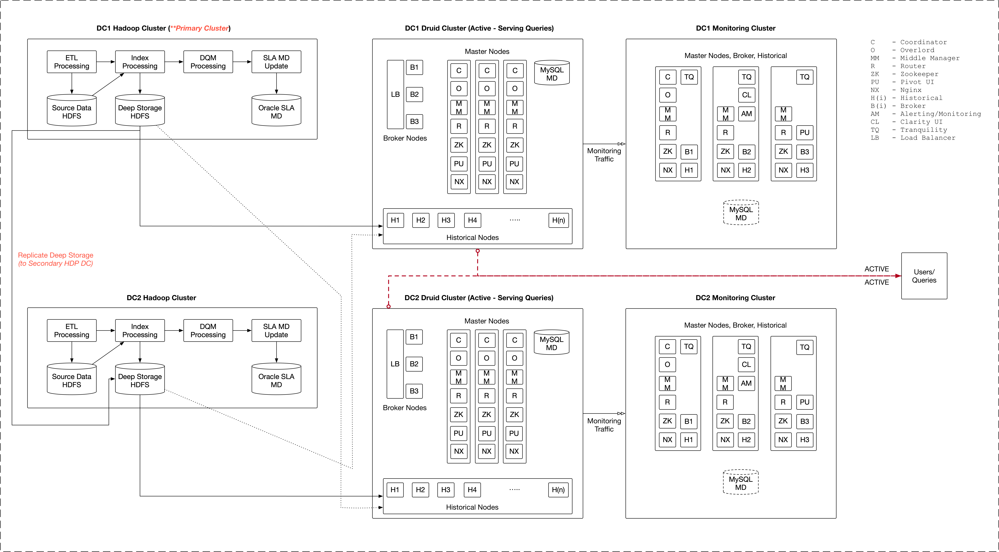

# Challenges in Druid's Multi-Datacenter Pipelines
## Context
[Apache Druid](https://druid.apache.org/) is an open-source timeseries database for fast analytics at scale. Apache Druid (incubating) is a data store designed for high-performance slice-and-dice analytics ("OLAP"-style) on large data sets. Druid is most often used as a data store for powering GUI analytical applications, or as a backend for highly-concurrent APIs that need fast aggregations

Often in production setups, Druid is used for powering business solutions which can help them drive business decisions using the slice-n-dice dashboards or reports. Most often times, its also used for sensorial and IOT use cases where the data is flowing in realtime speed. Druid support various types of ingestions. Some of the common ones are [Batch ingestions](https://druid.apache.org/docs/latest/ingestion/batch-ingestion.html) and [Realtime ingestions](https://druid.apache.org/docs/latest/ingestion/stream-ingestion.html). For the context of this article, we will be looking into the Batch ingestions and its complexities. Within Batch ingestions, there are 2 types of ingestions.

 - Hadoop Batch Ingestions
 - Native Batch Ingestions 

The [Native Batch Ingestions](https://druid.apache.org/docs/latest/ingestion/native_tasks.html) is relatively a newer concept from Apache Druid and is still being worked upon to get its maturity to be used in production pipelines. But the pre-dominant Batch ingestions are being done using [Hadoop Batch Ingestions](https://druid.apache.org/docs/latest/ingestion/hadoop.html). 

With Hadoop Batch Ingestions, we have inherent problems, especially while dealing with multiple data centers which act as a source data center for providing data to Druid and while on the Druid end, it is a Active-Active setup serving the users. In this particular setup, there is extreme importance given to the high availability of the system. At any point in time, the system has to be available 24x7 and available across the globe. In this particular there are 2 or more hadoop data centers which act as a primary data centers which feeds data into Druid and also there are 2 or more Druid data centers which reads asynchronously and simultaneously at the same time from the primary Hadoop centers.

### System constraints and requirements 
In a massive production setup @ scale serving millions of users at the same time, the system has some of these stringent functional and non-functional requirements which it has to be adhere to.

 - Active-Active Setup : Queries fired to both (or all Druid DCs) based on the Geo-IP
 - 95% of queries has to be served sub-second
 - Highly concurrent workload
 - Billions of rows to access and report on
 - Data consistency is key : One primary HDP DC produces data which gets loaded to all Active Druid DCs
 - High availability and 24x7 uptime

## Current Setup

## Challenges 
